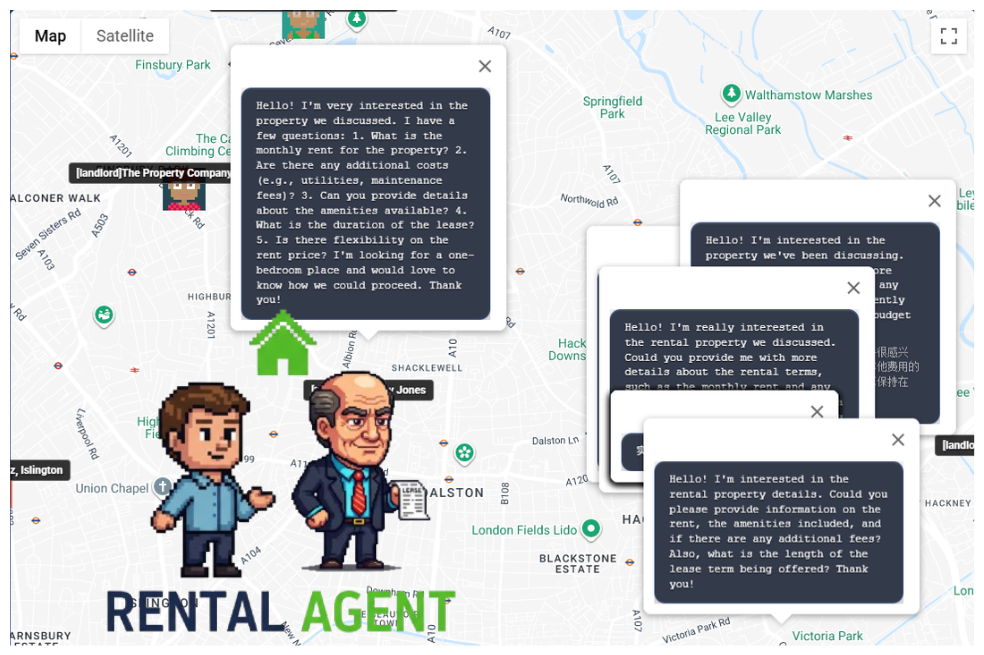
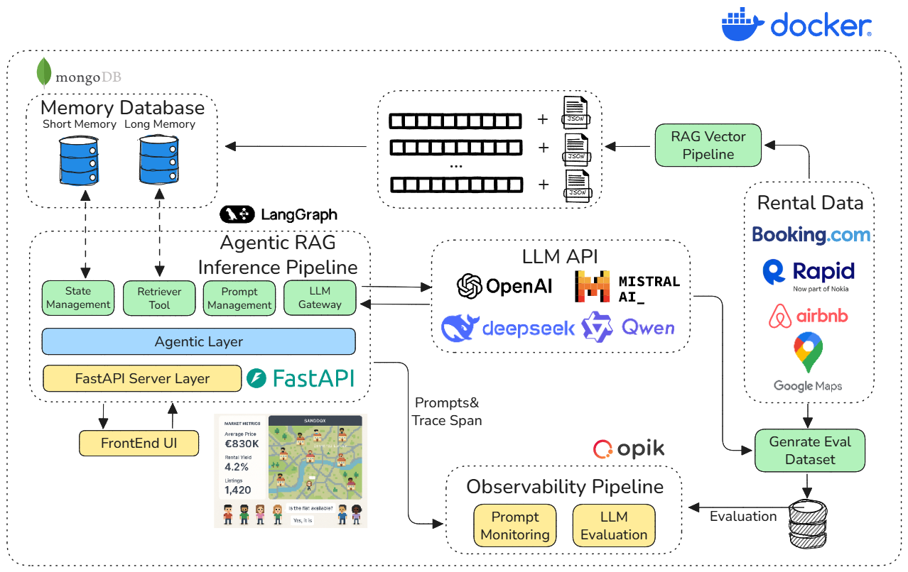
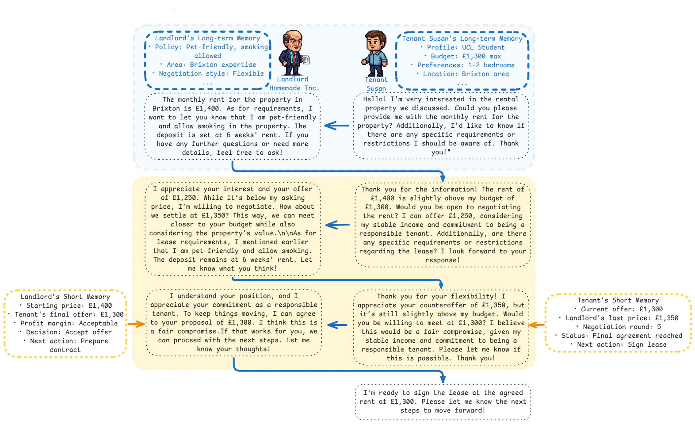

# Rental Agent: Multi-Agent Rental Negotiation System

[🇨🇳 中文版本](./docs/README/README-zh.md) | 🇺🇸 English

An intelligent rental negotiation system based on [LangGraph](https://github.com/langchain-ai/langgraph), implementing automated dialogue negotiation between tenants and landlords with real-time map visualization.



## Project Overview

This is a **multi-agent dialogue system** built with [LangGraph](https://github.com/langchain-ai/langgraph), focusing on **modular design**, **code clarity**, and **reusability**.

https://github.com/user-attachments/assets/6a550beb-5211-4f10-bd8e-61fb65b675dd

### Key Features

- 🤖 **Intelligent Negotiation**: Tenant agents automatically find suitable landlords and negotiate prices
- 🗺️ **Real-time Visualization**: Google Maps-based real-time negotiation process display
- 💾 **State Management**: MongoDB persistent storage for dialogue states and long-term memory
- 🔄 **Streaming Processing**: Real-time streaming output of negotiation processes and intermediate states
- 🎭 **Role Playing**: Different personality agent roles, such as rational and emotional types
- 📊 **Market Analysis**: Integrated UK rental market data analysis functionality
- 📄 **Contract Generation**: Automatic generation of virtual rental contracts based on successful negotiations [View Demo Contract](./docs/images/basic_rental_agreement_side_by_side.png)

###  System Architecture



### Demo Negotiation History
<p align="center">
  
</p>

##  Quick Start
###  Environment Setup

**Step 1: Clone the project**

```bash
git clone <repository-url>
cd Rental_Agent
```

**Step 2: Configure environment variables**

```bash
# Copy config file
cp backend/config/config.example.toml backend/config/config.toml

# Edit config file and fill in your API keys
vim backend/config/config.toml
```

**Step 3: Start services**

```bash
# Build and start all services
docker-compose up --build
```

###  Access Applications

After services start, you can access:

- **🎨 Frontend Interface**: <http://localhost:3000>
  - Real-time negotiation visualization
  - Agent role display
  - Negotiation process tracking

- **📚 API Documentation**: <http://localhost:8000/docs>
  - FastAPI auto-generated interactive documentation
  - WebSocket interface description
  - Test interface functionality

- **🗄️ MongoDB**: localhost:27017
  - Direct database connection
  - Use tools like MongoDB Compass

## Project Structure

```text
Rental_Agent/
├── 🐳 docker-compose.yml          # Docker service orchestration
├── 📚 README.md                   # Project documentation
├── backend/                       # Backend service
│   ├── 🐳 Dockerfile             # Backend container config
│   ├── 📦 pyproject.toml         # Python dependency management
│   ├── app/                      # Application core code
│   │   ├── 🤖 agents/            # Agent definitions
│   │   ├── 🌐 api_service/       # API service layer
│   │   ├── 💬 conversation_service/ # Dialogue controller
│   │   ├── 📊 data_analysis/     # Market data analysis
│   │   ├── 💾 mongo/             # Database operations
│   │   └── 🛠️ utils/             # Utility functions
│   ├── config/                   # Configuration files
│   └── dataset/                  # UK rental dataset
├── frontend/                     # Frontend application
│   ├── 🐳 Dockerfile            # Frontend container config
│   ├── 📦 package.json          # Node.js dependencies
│   └── src/                     # Source code
│       ├── 🗺️ maps/             # Map-related components
│       ├── 🌐 network/          # Network communication
│       └── 🎨 components/       # UI components
└── docs/                        # Detailed technical documentation
    ├── 📋 markdown/             # Project documentation
    └── 📖 reference/            # Reference materials
```


## References

For additional resources, tutorials, and tools used in this project, see our comprehensive [Reference Blog](./docs/README/reference_blog.md).
