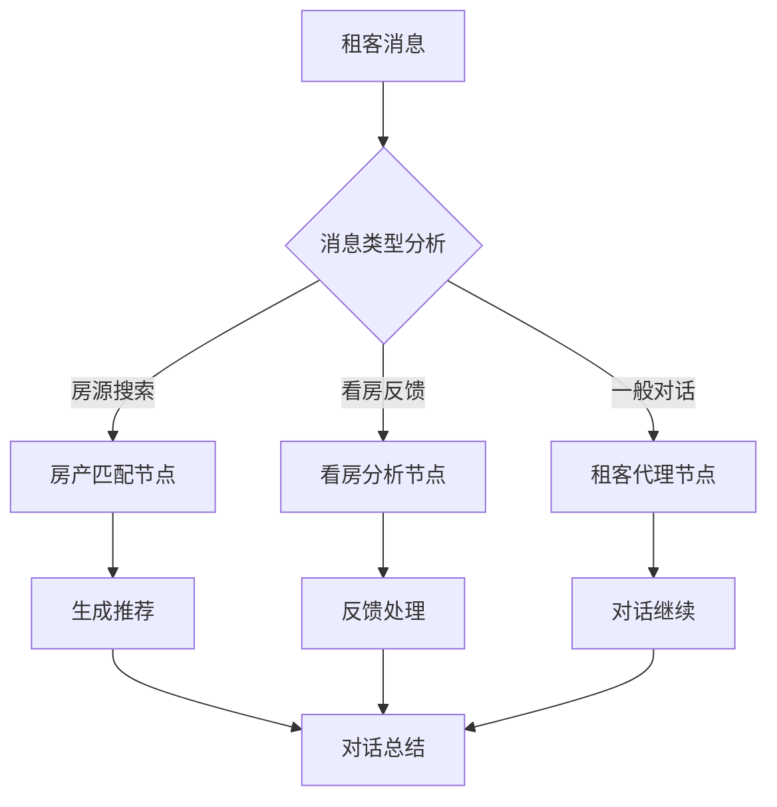
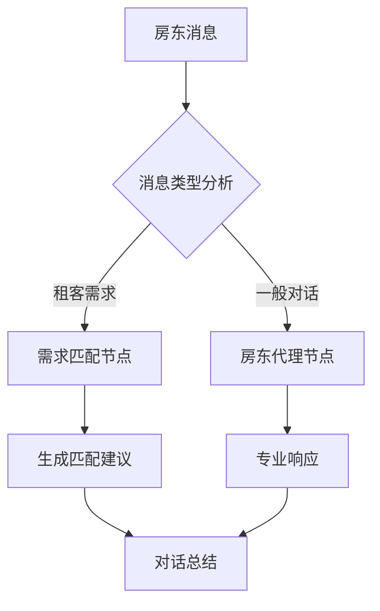

# Rental Agent: 智能租房协商系统

## 📋 项目概述

Rental Agent 是一个基于 AI 的智能租房市场协商系统，利用大语言模型和多智能体技术，实现租客与房东之间的自动化协商与匹配。该系统集成了真实的英国租房市场数据，提供从房源匹配到合同生成的完整解决方案。

## 🏗️ 核心架构

### 系统分层架构
```
┌─────────────────────────────────────────────────────────┐
│                    前端展示层                            │
│  ┌─────────────────┐  ┌──────────────────────────────┐  │
│  │  Streamlit UI   │  │    增强版协商面板             │  │
│  │  (简化查看器)    │  │ (实时监控 & 管理界面)         │  │
│  └─────────────────┘  └──────────────────────────────┘  │
├─────────────────────────────────────────────────────────┤
│                    API 服务层                           │
│  ┌─────────────────┐  ┌──────────────────────────────┐  │
│  │  FastAPI 主服务 │  │    WebSocket 实时通信         │  │
│  │  (RESTful API)  │  │    (消息推送 & 状态同步)       │  │
│  └─────────────────┘  └──────────────────────────────┘  │
├─────────────────────────────────────────────────────────┤
│                    业务逻辑层                           │
│  ┌─────────────────┐  ┌──────────────────────────────┐  │
│  │ 群体协商服务     │  │    对话管理服务               │  │
│  │ (匹配 & 协商)    │  │    (会话状态 & 消息路由)       │  │
│  └─────────────────┘  └──────────────────────────────┘  │
├─────────────────────────────────────────────────────────┤
│                    智能体工作流                         │
│  ┌─────────────────┐  ┌──────────────────────────────┐  │
│  │  租客智能体      │  │     房东智能体                │  │
│  │ (LangGraph工作流)│  │  (LangGraph工作流)            │  │
│  └─────────────────┘  └──────────────────────────────┘  │
├─────────────────────────────────────────────────────────┤
│                    数据访问层                           │
│  ┌─────────────────┐  ┌──────────────────────────────┐  │
│  │    MongoDB      │  │      数据处理                 │  │
│  │   (数据存储)     │  │   (Rightmove API集成)         │  │
│  └─────────────────┘  └──────────────────────────────┘  │
└─────────────────────────────────────────────────────────┘
```

## 🔄 核心 Pipeline

### 1. 数据收集与处理
- **数据源**: Rightmove API (英国最大房产网站)
- **覆盖范围**: 伦敦及周边地区 154 套租赁房源
- **数据处理**: 自动化数据清洗、标准化和分析
- **存储**: MongoDB + Pydantic 模型验证

### 2. 智能匹配算法
```python
# 匹配评分机制
def calculate_match_score(tenant, property):
    score = 0
    # 预算匹配 (40%)
    if property.rent <= tenant.max_budget:
        score += 40
    
    # 位置偏好 (30%)
    distance_score = calculate_location_preference(tenant, property)
    score += distance_score * 30
    
    # 房型需求 (20%)
    bedroom_match = check_bedroom_requirements(tenant, property)
    score += bedroom_match * 20
    
    # 其他偏好 (10%)
    amenity_score = check_amenities(tenant, property)
    score += amenity_score * 10
    
    return score
```

### 3. 多智能体协商工作流

#### 租客智能体工作流 (LangGraph)


#### 房东智能体工作流 (LangGraph)


### 4. 群体协商系统
- **会话管理**: 支持多租客-房东并发协商
- **实时通信**: WebSocket 推送消息和状态更新
- **自动化协商**: 多轮自动对话模拟
- **状态监控**: 实时协商统计和进度跟踪

### 5. 合同生成
- **LaTeX 模板**: 专业租赁协议模板
- **自动填充**: 基于协商结果自动生成合同
- **PDF 输出**: 高质量 PDF 文档生成

## 🚀 创新点

### 1. **真实数据驱动的 AI 系统**
- **数据真实性**: 集成 Rightmove API 获取真实市场数据
- **市场洞察**: 基于 154 套房源的价格分布和地理分析
- **动态匹配**: 结合实时市场数据进行智能匹配

### 2. **多智能体协商架构**
- **双向智能体**: 租客和房东各有专门的 AI 代理
- **LangGraph 工作流**: 复杂的状态管理和决策流程
- **上下文感知**: 智能体具备记忆和上下文理解能力

### 3. **实时协商体验**
- **WebSocket 通信**: 毫秒级消息推送
- **流式响应**: AI 回复支持流式输出，提升用户体验
- **状态同步**: 多端实时状态同步

### 4. **群体智能协商**
- **批量匹配**: 支持多租客同时协商
- **自动化模拟**: 可模拟整个协商过程
- **统计分析**: 实时协商效果统计和优化

### 5. **端到端解决方案**
- **完整流程**: 从数据收集到合同签署的完整自动化
- **模块化设计**: 高度解耦的微服务架构
- **可扩展性**: 支持大规模部署和横向扩展

### 6. **先进的工程实践**
- **Modern Stack**: FastAPI + MongoDB + LangChain + LangGraph
- **类型安全**: 全面的 Pydantic 模型验证
- **容器化**: Docker 部署支持
- **监控集成**: Opik 追踪和性能监控

## 📊 技术规格

### 核心技术栈
- **后端框架**: FastAPI (Python 3.13)
- **AI 框架**: LangChain + LangGraph
- **数据库**: MongoDB
- **前端**: Streamlit
- **实时通信**: WebSocket
- **文档生成**: LaTeX + XeLaTeX

### 数据规模
- **房源数量**: 154 套真实房源
- **价格范围**: £340 - £7,250/月
- **地理覆盖**: 伦敦及周边 28.1km × 17.3km 区域
- **房型分布**: 工作室到 6+ 卧室的完整覆盖

### 性能指标
- **匹配准确率**: 基于多维度评分的智能匹配
- **响应时间**: 亚秒级 AI 响应
- **并发支持**: 多会话并发协商
- **可用性**: 7×24 小时服务

## 🎯 应用场景

### 1. **租客场景**
- 智能房源推荐
- 自动化协商谈判
- 看房安排优化
- 个性化服务体验

### 2. **房东场景**
- 租客筛选与匹配
- 自动化客服响应
- 市场定价建议
- 出租效率提升

### 3. **平台场景**
- 协商效果分析
- 市场趋势洞察
- 用户行为分析
- 业务流程优化

## 🔮 未来展望

### 技术演进方向
1. **多语言支持**: 扩展到多个国家和地区
2. **高级 AI 功能**: 集成更先进的大语言模型
3. **预测分析**: 基于历史数据的市场预测
4. **区块链集成**: 智能合约和数字签名

### 业务拓展计划
1. **B2B 服务**: 为房产中介提供 SaaS 解决方案
2. **国际化**: 扩展到更多国际房产市场
3. **生态整合**: 与金融、保险等服务集成
4. **移动应用**: 开发移动端应用

---

**项目状态**: 积极开发中 | **最后更新**: 2025年5月28日 | **版本**: 1.0

该项目展示了 AI 技术在传统房地产行业的创新应用，通过智能化、自动化的方式重新定义了租房协商体验，为行业数字化转型提供了有价值的参考案例。
