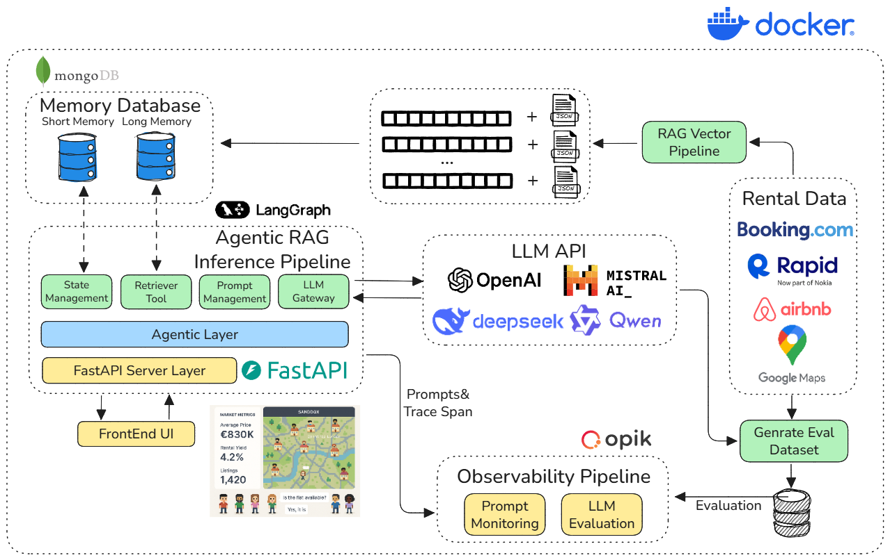

# Rental Agent: Multi-Agent Rental Negotiation System

[🇺🇸 English](../../README.md) | 🇨🇳 中文版本

基于 LangGraph 的智能租房协商系统，实现租客与房东之间的自动化对话协商，并通过实时地图可视化展示协商过程。


## 项目概述

这是一个**多智能体对话系统**，使用 [LangGraph](https://github.com/langchain-ai/langgraph) 构建，专注于**模块化设计**、**代码清晰度**和**可重用性**。

### 核心特性

- 🤖 **智能协商**: 租客智能体自动寻找合适房东并进行价格协商
- 🗺️ **实时可视化**: 基于Google Maps的实时协商过程展示
- 💾 **状态管理**: MongoDB持久化存储对话状态和长期记忆
- 🔄 **流式处理**: 实时流式输出协商过程和中间状态
- 🎭 **角色扮演**: 不同性格的智能体角色，如理性型、情感型等
- 📊 **市场分析**: 集成英国租房市场数据分析功能
- 📄 **合同生成**: 基于成功协商自动生成虚拟租房合同 [查看演示合同](../images/basic_rental_agreement_side_by_side.png)

### 系统架构


### 演示协商历史


## 快速开始

### 环境配置

**步骤 1: 克隆项目**

```bash
git clone <repository-url>
cd Rental_Agent
```

**步骤 2: 配置环境变量**

```bash
# 复制配置文件
cp backend/config/config.example.toml backend/config/config.toml

# 编辑配置文件，填入你的API密钥
vim backend/config/config.toml
```

**步骤 3: 启动服务**

```bash
# 构建并启动所有服务
docker-compose up --build
```

### 访问应用

服务启动后，你可以访问：

- **🎨 前端界面**: <http://localhost:3000>
  - 实时协商可视化
  - 智能体角色展示
  - 协商过程追踪

- **📚 API 文档**: <http://localhost:8000/docs>
  - FastAPI 自动生成的交互式文档
  - WebSocket 接口说明
  - 测试接口功能

- **🗄️ MongoDB**: localhost:27017
  - 数据库直接连接
  - 可使用 MongoDB Compass 等工具
### 访问应用

服务启动后，你可以访问：

- **🎨 前端界面**: <http://localhost:3000>
  - 实时协商可视化
  - 智能体角色展示
  - 协商过程追踪

- **📚 API 文档**: <http://localhost:8000/docs>
  - FastAPI 自动生成的交互式文档
  - WebSocket 接口说明
  - 测试接口功能

- **🗄️ MongoDB**: localhost:27017
  - 数据库直接连接
  - 可使用 MongoDB Compass 等工具

## 项目结构


```text
Rental_Agent/
├── 🐳 docker-compose.yml          # Docker service orchestration
├── 📚 README.md                   # Project documentation
├── backend/                       # Backend service
│   ├── 🐳 Dockerfile             # Backend container config
│   ├── 📦 pyproject.toml         # Python dependency management
│   ├── app/                      # Application core code
│   │   ├── 🤖 agents/            # Agent definitions
│   │   ├── 🌐 api_service/       # API service layer
│   │   ├── 💬 conversation_service/ # Dialogue controller
│   │   ├── 📊 data_analysis/     # Market data analysis
│   │   ├── 💾 mongo/             # Database operations
│   │   └── 🛠️ utils/             # Utility functions
│   ├── config/                   # Configuration files
│   └── dataset/                  # UK rental dataset
├── frontend/                     # Frontend application
│   ├── 🐳 Dockerfile            # Frontend container config
│   ├── 📦 package.json          # Node.js dependencies
│   └── src/                     # Source code
│       ├── 🗺️ maps/             # Map-related components
│       ├── 🌐 network/          # Network communication
│       └── 🎨 components/       # UI components
└── docs/                        # Detailed technical documentation
    ├── 📋 markdown/             # Project documentation
    └── 📖 reference/            # Reference materials
```

## 参考资料

有关本项目中使用的其他资源、教程和工具，请参阅我们的综合 [参考博客](./reference_blog.md)。
